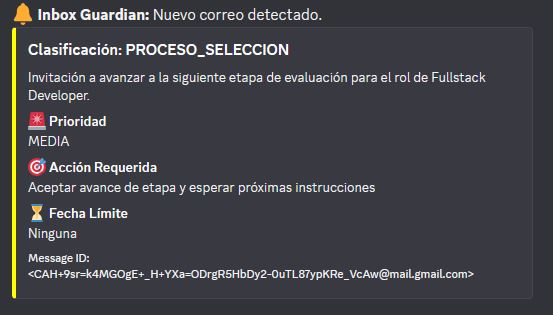
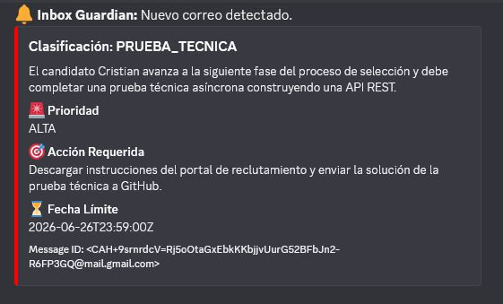

# Inbox Guardian: Tu Asistente de Carrera Inteligente

### El problema
Como desarrollador en búsqueda activa, mi bandeja de entrada se convirtió en mi mayor cuello de botella. Entre cientos de correos de spam, suscripciones irrelevantes y ofertas de empleo, el riesgo de perder una oportunidad de oro era real. 

### La solución
**Inbox Guardian** no es solo un filtro de correos; es un agente autónomo que vive en la nube, procesando mi correspondencia en tiempo real para extraer únicamente lo que importa.

### ¿Qué hace Inbox Guardian por mí?
- **Inteligencia Contextual:** Utiliza modelos de IA generativa (Gemini) para entender la intención real de cada correo, diferenciando un "spam" publicitario de una invitación a una entrevista técnica.
- **Alertas en Tiempo Real:** Filtra el ruido y notifica instantáneamente en mi canal privado de Discord, categorizando el mensaje por urgencia y fecha límite.
- **Arquitectura Basada en Eventos:** Diseñado para operar 24/7 sin intervención manual, garantizando que nunca más perderé una fecha de entrega o un proceso de selección.

  

  

### Impacto Técnico
- **Procesamiento Asíncrono:** Gestión de colas para asegurar que el sistema sea resiliente y maneje picos de tráfico.
- **Integración de Datos:** Uso de ORMs avanzados (Prisma) para mantener un historial auditable de toda la comunicación profesional.
- **Infraestructura Cloud:** Desplegado en contenedores optimizados con monitoreo activo para garantizar una disponibilidad continua.

---

## ¿Por qué este proyecto?
Este sistema representa mi filosofía de trabajo: **optimización y automatización**. No solo busco resolver problemas, sino construir sistemas que escalen conmigo y me permitan enfocarme en lo que realmente aporta valor: **crear tecnología.**